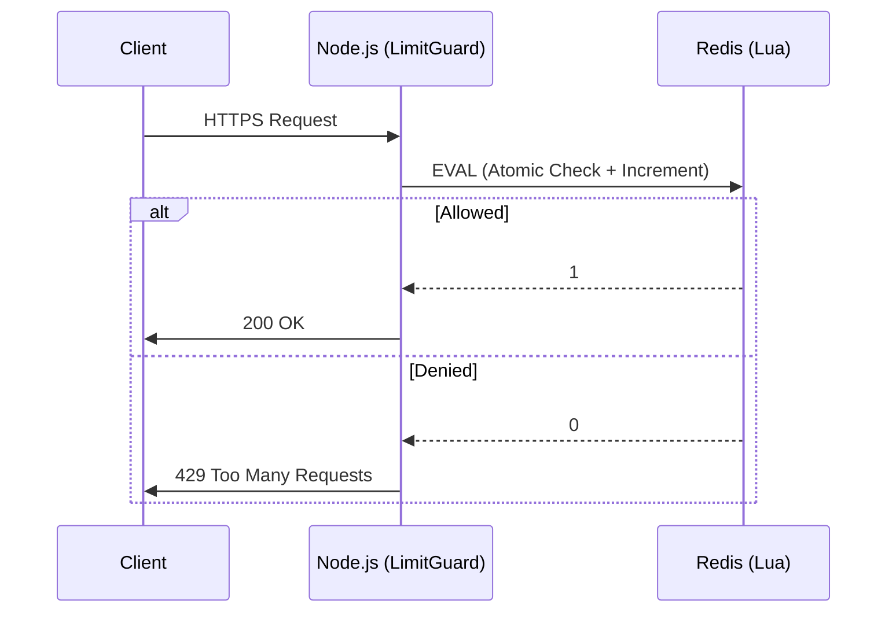

# LimitGuard
## Distributed Rate Limiter with Atomic Redis Lua Scripting

<div align="center">


**Tech Stack**


**Patterns**


</div>

---

## Visual Overview

### Dashboard

<p align="center">
  
</p>

*Real-time rate limiting visualization with cyberpunk aesthetics*

### Atomic Flow

<p align="center">
  
</p>

*Lua-based atomic operations prevent race conditions*

### Concurrency Test Results

<p align="center">
  
</p>

*100 concurrent requests, zero race conditions - atomicity proven*

---

## Overview

**LimitGuard** is a distributed rate limiter that solves the fundamental race condition problem in traditional rate limiters by implementing the **Token Bucket Algorithm** directly inside Redis using **Lua Scripting**, guaranteeing O(1) atomicity even under massive concurrency.

### The Problem

Traditional rate limiters suffer from **race conditions** when they perform `GET` then `INCR` operations separately. Under high concurrency, this can allow more requests than the configured limit.

### The Solution

**Atomic Operations**: LimitGuard executes validation and increment in a single Redis Lua script, achieving 0% race conditions (verified with `autocannon` at 100 concurrent connections).

### Key Features

- **Atomic Operations**: 0% race conditions with Redis Lua scripting
- **Fail-Open Strategy**: System degrades gracefully if Redis crashes (allows traffic vs. causing outage)
- **End-to-End Encryption**: Self-signed HTTPS (TLS 1.2+) for API and Dashboard
- **Precision Timer**: Propagates Redis TTL to frontend for real-time "Reset Countdown"
- **Real-time Dashboard**: Live visualization of traffic spikes, blocked requests, and metrics

---

## Architecture



---

## Getting Started

### Prerequisites
- Docker & Docker Compose
- Node.js v18+

### 1. Installation & Infrastructure
```bash
# Clone the repo
git clone https://github.com/Kimosabey/limit-guard.git
cd limit-guard

# Start Redis Infrastructure
docker-compose up -d

# Install Dependencies
npm install
cd dashboard && npm install && cd ..
```

### 2. Generate SSL Certificates (Security First)
```bash
node src/scripts/generateCert.js
# Output: server.key, server.cert
```

### 3. Run the Stack

**Backend (Port 8800)**
```bash
node src/server.js
```

**Frontend Dashboard (Port 3300)**
```bash
cd dashboard
npm run dev
```

---

## Verification

Run the Load Test to prove atomicity:
```bash
node src/scripts/loadTest.js
```

**Expected Output:**
```text
Success (200 OK): 10 (Matches Limit)
Blocked (429):    190
TEST PASSED: strict rate limit enforced.
```

---

## Documentation Index

| Doc | Description |
| :--- | :--- |
| **[SETUP.md](./docs/SETUP.md)** | Step-by-step installation & troubleshooting |
| **[FLOW.md](./docs/FLOW.md)** | Deep dive into Architecture & Atomic Logic |
| **[CASES.md](./docs/CASES.md)** | QA Playbook & Failure Scenarios |
| **[INTERVIEW.md](./docs/INTERVIEW.md)** | Senior QA: "Defend Your Design" |

---

## Project Structure

```
limit-guard/
├── src/
│   ├── scripts/
│   │   └── rateLimit.lua       # The Atomic Brain
│   ├── middleware/
│   │   └── rateLimiter.js      # Fail-Open Logic
│   └── server.js               # HTTPS Gateway
├── dashboard/                  # Next.js Visualization
└── docker-compose.yml          # Infrastructure
```

---

## License

MIT License

---

**Built by**: [Harshan Aiyappa](https://github.com/Kimosabey)  
**Tech Stack**: Node.js • Redis • Lua • Next.js  
**Pattern**: Rate Limiting • Token Bucket • Atomic Operations
