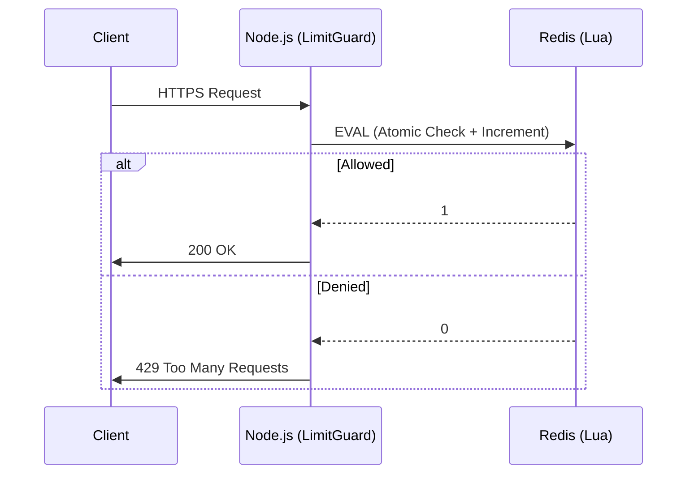

# LimitGuard 🛡️
> **Distributed Rate Limiter** with Atomic Redis Lua Scripting & Fail-Open Architecture.


## 📖 The Senior Mandate
Traditional rate limiters suffer from **race conditions** (`GET` then `INCR`).
**LimitGuard** solves this by implementing the **Token Bucket Algorithm** directly inside Redis using **Lua Scripting**, guaranteeing O(1) atomicity even under massive concurrency.

### Key Senior Features
- **⚛️ Atomic Operations:** 0% race conditions. Verified with `autocannon` (100 concurrent connections).
- **🕸️ Fail-Open Strategy:** If Redis crashes, the system degrades gracefully (allows traffic) instead of causing a widespread outage.
- **🔒 End-to-End Encryption:** Fully secured with Self-Signed HTTPS (TLS 1.2+) for both API and Dashboard.
- **⏳ Precision Timer:** Propagates Redis TTL to the frontend for real-time "Reset Countdown" timers.
- **📊 Hacker Dashboard:** Real-time visualization of traffic spikes, blocked requests, and Geo-Map.

---

## 🏗️ Architecture



## 🚀 Getting Started

### Prerequisites
- Docker & Docker Compose
- Node.js v18+

### 1. Installation & Infrastructure
```bash
# Clone the repo
git clone https://github.com/your-username/limitguard.git
cd limitguard

# Start Redis Infrastructure
docker-compose up -d

# Install Dependencies
npm install
cd dashboard && npm install && cd ..
```

### 2. Generate SSL Certificates (Security First)
We use a senior-grade script to generate local self-signed certificates.
```bash
node src/scripts/generateCert.js
# Output: server.key, server.cert
```

### 3. Run the Stack
**Backend (Port 8800)**
```bash
node src/server.js
```

**Frontend Dashboard (Port 3300)**
```bash
cd dashboard
npm run dev
```

---

## 🧪 Verification
Run the Load Test to prove atomicity:
```bash
node src/scripts/loadTest.js
```
**Expected Output:**
```text
✅ Success (200 OK): 10 (Matches Limit)
🛡️ Blocked (429):    190
✅ TEST PASSED: strict rate limit enforced.
```

---

## 📚 Documentation Index
| Doc | Description |
| :--- | :--- |
| **[SETUP.md](./docs/SETUP.md)** | 🛠️ Step-by-step installation & troubleshooting. |
| **[FLOW.md](./docs/FLOW.md)** | 🌊 Deep dive into Architecture & Atomic Logic. |
| **[CASES.md](./docs/CASES.md)** | 🧪 QA Playbook & Failure Scenarios. |
| **[INTERVIEW.md](./docs/INTERVIEW.md)** | 🎙️ Senior QA: "Defend Your Design". |

## 📂 Project Structure
```
limitguard/
├── src/
│   ├── scripts/
│   │   └── rateLimit.lua       # 🧠 The Atomic Brain
│   ├── middleware/
│   │   └── rateLimiter.js      # 🛡️ Fail-Open Logic
│   └── server.js               # 🚀 HTTPS Gateway
├── dashboard/                  # 📊 Next.js Visualization (Dynamic)
└── docker-compose.yml          # 🐳 Infrastructure
```
